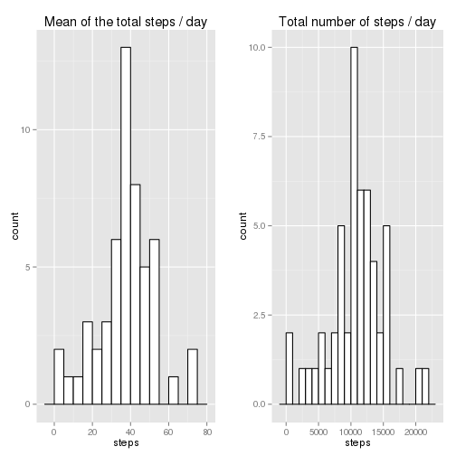
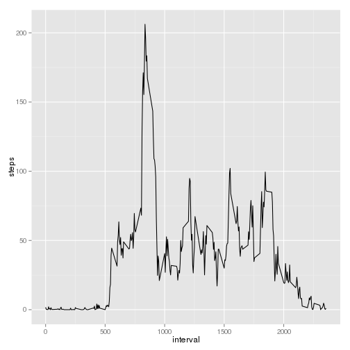
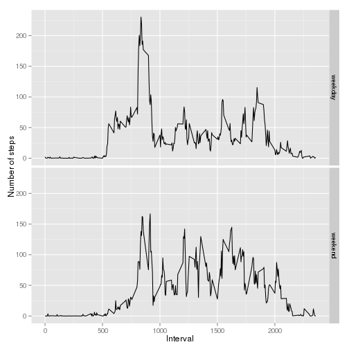

## Init directories and load required libraries


```r
setwd('/home/babl/coursera/Reproducible_Research/pa1')
```

I'm from Russia and need to set Eng locale to correctly work with date/time functions.


```r
Sys.setlocale("LC_TIME","en_US.UTF-8")
```

```
## [1] "en_US.UTF-8"
```


```r
library(data.table)
library(ggplot2)
library(grid)
library(gridExtra)
library(knitr)
```

## Loading and preprocessing the data


```r
data<-data.table(read.csv("activity.csv", header=TRUE, na.strings="NA"))
```

## What is mean total number of steps taken per day?

### Make a histogram of the total number of steps taken each day

I don't underastand, what I need to do (may be a language problem): a histogram of total number of steps (like in subtitle), or a histogram of mean total number (like in title), that's why I create both histogramms:


```r
total_steps_by_date <- aggregate(steps ~ date, data, 'sum', na.rm=TRUE)
mean_steps_by_date <- aggregate(steps ~ date, data, 'mean', na.rm=TRUE)

plot1 <- ggplot(mean_steps_by_date, aes(x=steps)) +
  geom_histogram(binwidth=5, colour="black", fill="white") +
  ggtitle('Mean of the total steps / day')

plot2 <- ggplot(total_steps_by_date, aes(x=steps)) +
  geom_histogram(binwidth=1000, colour="black", fill="white") +
  ggtitle('Total number of steps / day')

grid.arrange(plot1,plot2,ncol=2)
```

 

### Calculate and report the mean and median total number of steps taken per day


```r
mean<-mean(total_steps_by_date$steps,na.rm=TRUE)
median<-median(total_steps_by_date$steps,na.rm=TRUE)
```

```r
print(mean)
```

```
## [1] 10766.19
```

```r
print(median)
```

```
## [1] 10765
```

The mean of total number of steps taken per day are 1.0766189 &times; 10<sup>4</sup> and median are 10765.

## What is the average daily activity pattern?


```r
mean_steps_by_interval <- aggregate(steps ~ interval, data, 'mean', na.rm=TRUE)
ggplot(mean_steps_by_interval, aes(x = interval, y = steps)) + geom_line()
```

 

Which 5-minute interval, on average across all the days in the dataset, contains the maximum number of steps?


```r
mean_steps_by_interval[ which.max(mean_steps_by_interval$steps) ,]
```

```
##     interval    steps
## 104      835 206.1698
```

## Imputing missing values

### Calculate and report the total number of missing values in the dataset (i.e. the total number of rows with NAs)


```r
sum(is.na(data))
```

```
## [1] 2304
```

### Devise a strategy for filling in all of the missing values in the dataset. The strategy does not need to be sophisticated. For example, you could use the mean/median for that day, or the mean for that 5-minute interval, etc.

I choose stragtegy to fill NA values with mean steps by interval, because of there are some days where all records are NA.

I convert steps to Double type, because of mean is not integer.

### Create a new dataset that is equal to the original dataset but with the missing data filled in


```r
extrapolated_data <- data
extrapolated_data$steps<-as.double(extrapolated_data$steps)
for (i in 1:nrow(extrapolated_data)) {
  if (is.na(extrapolated_data[i,]$steps)) {
      extrapolated_data[i,]$steps <- mean_steps_by_interval[mean_steps_by_interval$interval==extrapolated_data[i,]$interval,]$steps
    }
}
```

### Make a histogram of the total number of steps taken each day


```r
ex_total_steps_by_date <- aggregate(steps ~ date, extrapolated_data, 'sum')
ex_mean_steps_by_date <- aggregate(steps ~ date, extrapolated_data, 'mean')

plot1 <- ggplot(ex_mean_steps_by_date, aes(x=steps)) +
  geom_histogram(binwidth=5, colour="black", fill="white") +
  ggtitle('Mean of the total steps / day')

plot2 <- ggplot(ex_total_steps_by_date, aes(x=steps)) +
  geom_histogram(binwidth=1000, colour="black", fill="white") +
  ggtitle('Total number of steps / day')

grid.arrange(plot1,plot2,ncol=2)
```

 

### Calculate and report the mean and median total number of steps taken per day.


```r
ex_mean<-mean(ex_total_steps_by_date$steps)
ex_median<-median(ex_total_steps_by_date$steps)
```

```r
print(ex_mean)
```

```
## [1] 10766.19
```

```r
print(ex_median)
```

```
## [1] 10766.19
```

The mean of total number of steps taken per day are 1.0766189 &times; 10<sup>4</sup> and median are 1.0766189 &times; 10<sup>4</sup>.

### Do these values differ from the estimates from the first part of the assignment?

Yes, median values are differ, but not mean values, because of we fill NA values with mean data:


```r
differ_data<-data.frame(Calculation=c('Without NA', 'Extrapolated'), Mean=c(mean, ex_mean), Median=c(median, ex_median))
kable(head(differ_data), format = "markdown")
```


|Calculation  |     Mean|   Median|
|:------------|--------:|--------:|
|Without NA   | 10766.19| 10765.00|
|Extrapolated | 10766.19| 10766.19|

## Are there differences in activity patterns between weekdays and weekends?

I'm continue to work with extrapolated_data.

Create new columns `wday` and `factorday` to extract weekend days from others:


```r
weekend <- c('saturday','sunday')
extrapolated_data$wday<-tolower(weekdays(strptime(extrapolated_data$date, '%Y-%m-%d')))
extrapolated_data$factorday <- factor((extrapolated_data$wday %in% weekend), labels=c('weekday','weekend'))
ex_steps_by_interval <- aggregate(steps ~ interval + factorday, extrapolated_data, 'mean')

ggplot(ex_steps_by_interval, aes(x = interval, y = steps)) + geom_line() + facet_grid(factorday ~ .) + labs(x="Interval", y="Number of steps")
```

 
